If you've been around the internet for some times, you might have come accross psychos using keyboards with arcane key positionning.

I'm one of them.

And you should be too.

# Preambule

The **physical layout** is the position of keys on the keyboard. It isthe focus on this article.

## Vocabulary

All physical layouts include:

- A **home row** where the fingers rest when not typing
  - On a QWERTY layout the home row is `ASDFGHJKL;'#`
- A **bottom** and **top row** containing the rest of the alphanumeric keys

In standard keyboards you also have:

- A **thumb row** below the bottom row, containing space, alt, ctrl, etc.
- A **number row** above the top row containing numbers, symbols, and backspace

# Normie layouts issues

Normie keyboards have a few different physical layouts: ISO, ANSI, JIS, KS, etc.

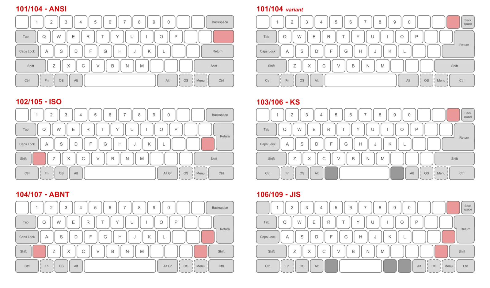

They all share multiple issues:

- Positionning of alphanumeric keys
  - Fingers don't have a natural vertical movement to reach keys on the upper and lower row
  - Which finger is supposed to press `Y` or `B` on a QWERTY layout?
- Unergonomic numbers and symbols access
  - Accessing top row numbers is inconvenient as it requires moving all your hand
  - Symbols are placed arbitrarily, making them hard to remember
- Completely absurd positionning of modifiers and non-alphanumeric keys
  - Space is accessible, but shift and backspace are on corners of the keyboard despite both being in the top 5 most used keys

## The ISO catastrophe

The ISO keyboard is a 105 keys layout defined as "standard" by the International Organization for Standardization.

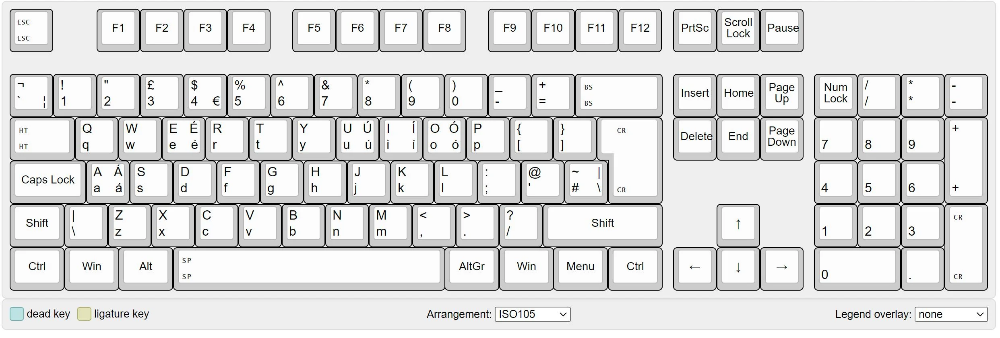

It is by far the worst of all existing layouts:

- The enter key is placed on a TRIPLE pinky extension, meaning you need to move your pinky 3 keys to the right to press it
- The left Shift is placed on a double extension and row change
  - Shift is the fourth most used key on a keyboard, but that's for the software layout article!

## The JIS innovation

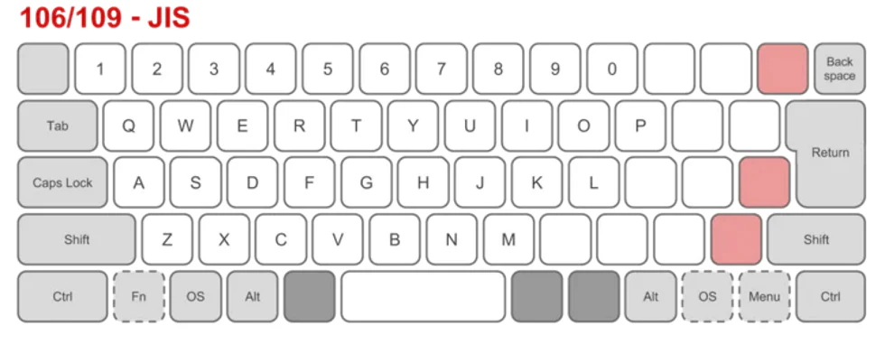

The JIS layout is still bad but it has a few one thing going for it:

- It adds two extra keys around the space bar, giving both thumbs access to 3 keys total

Unfortunately, it falls in the same pitfalls as ISO by having a terrible enter key positionning, making it even worse with a short backspace key.

# First improvements

So now that we know what's wrong with normie keyboards let's see what we can do to fix them.

## Vertical alignment

For fingers to move smoothly between keys it is much better to have keys assigned to a finger in a straight column.

Fixing this brings you the [TECK keyboard](https://www.pcmag.com/reviews/truly-ergonomic-computer-keyboard-teck-model-207):

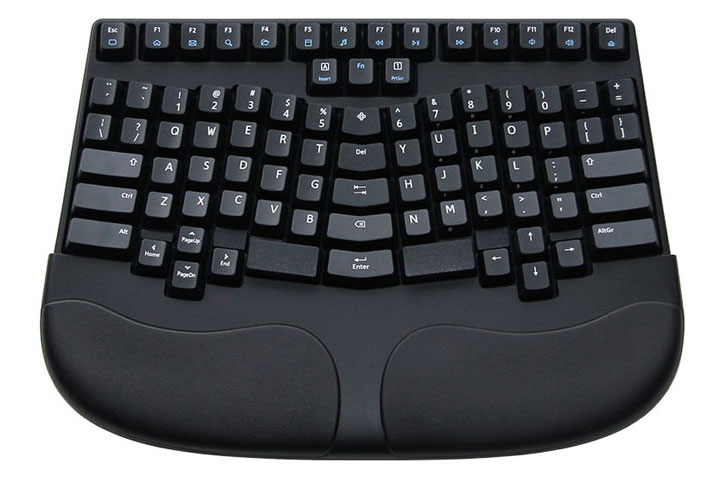

Keys are clearly assigned to fingers. Index moving distance is also greatly reduced.

## Thumb cluster

But we're still not putting our thumbs to good use. The next obvious addition is the **thumb cluster**: assigning multiple keys to each thumb!

A good example is the [Osprey](https://kbd.news/The-Osprey-keyboard-953.html):

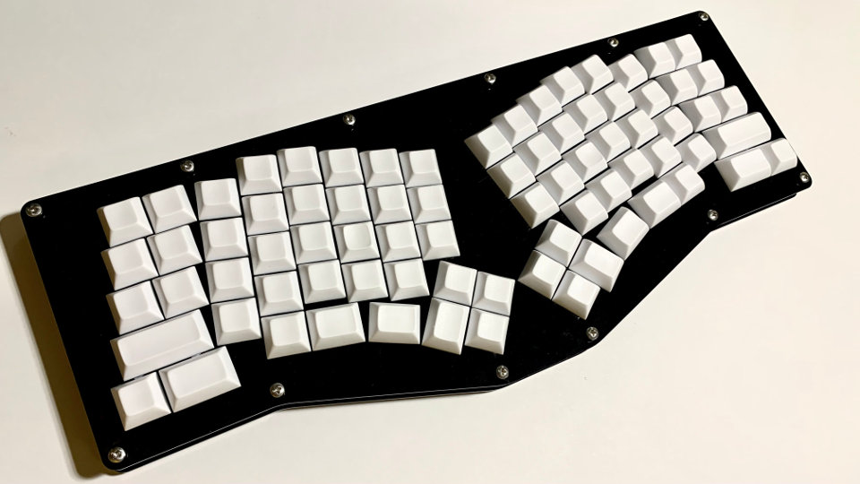

This gives us easy to access extra keys, perfect for often used keys like space, backspace, enter, shift, ...

Thumb clusters can go from 2 keys up to 6 in some keyboards. After trying out 4, 6, 2, and 3 keys thumb clusters I found that 3 keys is the sweet spot.

The thumb is highly mobile, and 3 keys can be easily reachable if arranged in a curve.

With 4 and more keys you end up stacking keys vertically, which is inconvenient. The thumb is not well suited for vertical movement when your hand is over a table, as you're hitting keys with the side of your thumb.

# The two horsemen of ergonomics

## Stagger

I'm cheating a little bit here. The two previous keyboards already used stagger.

"Staggering" keys is adding some vertical offset to columns to better accomodate for natural fingers positionning.

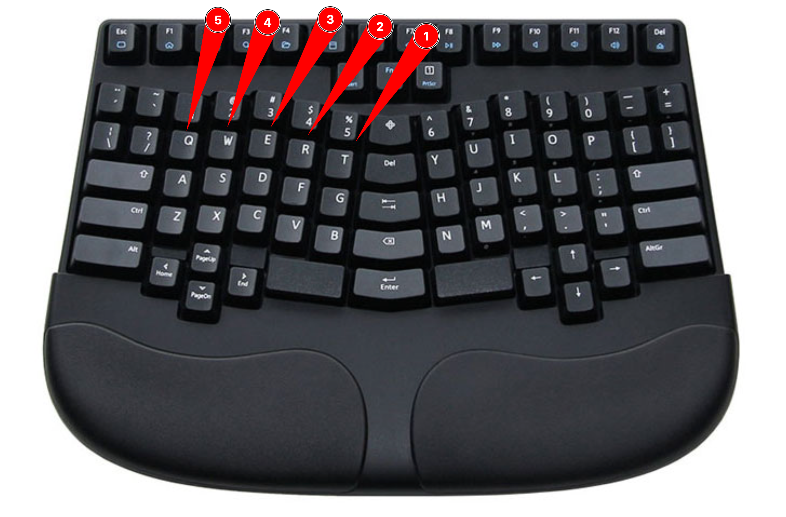

This level of stagger is pretty conservative.

The pinky finger actual resting position is *much lower* than other fingers, almost a full key lower.

In extrem cases you get the [Kleks](https://kbd.news/Kleks-keyboard-1161.html):

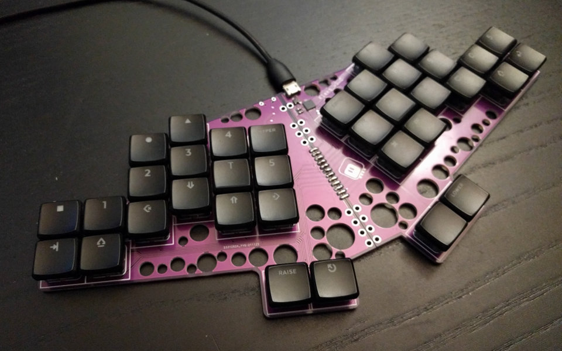

For ergonomics, stagger is primordial. The exact values are still up for debate, but it's clear some amount of stagger is good for ergonomics!

## Splay

But stagger alone is not enough. Why should keys all be aligned to the same vertical axis?

Both the ring and the pinky finger move slightly to the side compared to the index and middle finger.

A good example is the [re-gret](https://github.com/rschenk/re-gret):

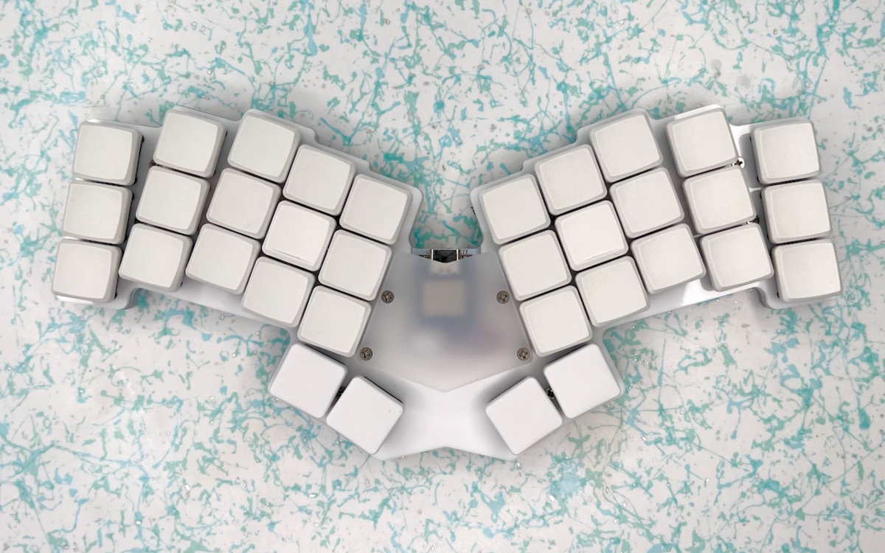

Both the ring and pinky column are angled, making them more comfortable to reach!

# Late game

## Minimalism

One way to solve the numbers row issue is to make your keyboard as compact as possible. You access numbers and symbols by holding a "layer" key which will we talk about in the next article.

The only thing you need to know is that a standard 106 keys keyboard can easily be reduced down to 30 keys. It makes it more intuitive and ergonomic.

Using low profile keys also greatly reduces the footprint of the keyboard by reducing its vertical height. Reduced height results in improved ergonomics as you can more easily adjust desk and chair height for proper posture.

This is how I got to the [tern](https://github.com/rschenk/tern):

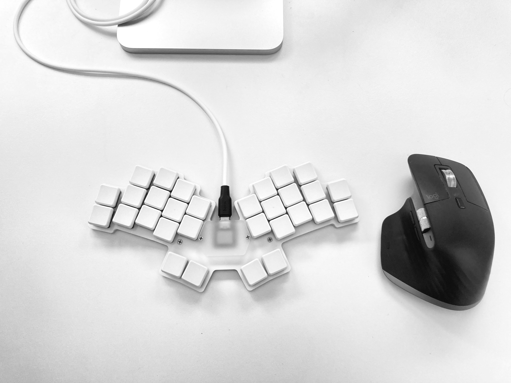

It sports all things I covered so far and looks gorgeously minimalist.

It fits in a pocket, is only a single centimeter tall, and is a joy to type on.

But there are diminishing returns to removing keys. Going down to 30 is pretty extreme.

I'd say a good middle-ground is from 34 to 40! You still get a full alphanumeric layer and maintain good ergonomics, as long as you use a good software layout!

## Split keyboards

Splitting a keyboard in two halves lets you position them more freely. You can select both the distance and the angle between both halves.

I used split keyboards for 5 years before moving back to unibody designs.

While splits are very convenient at home they're annoying to setup if you need to move your keyboard around. Mine also happened to be wired which made at worse as I need an extra cable.

I think wireless split is the true endgame, but at the moment I'm sticking to unibody for convenience!

## Curved keyboards

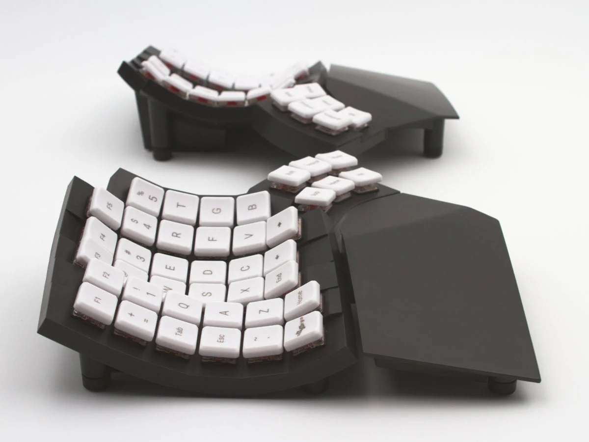

Curved keyboard make keys even closer to each finger by following the natural curve of your hand.

I love the idea, but currently available curved keyboard are prohibitely expensive, physically huge, and a pain to transport.

It is the only keyboard ergonomics feature I haven't tried yet, so I don't have strong opinions about it. But damn, do they look cool ❤️

# Tolkeeb Zero

This brings us to the keyboard I designed from scratch, the Tolkeeb Zero:

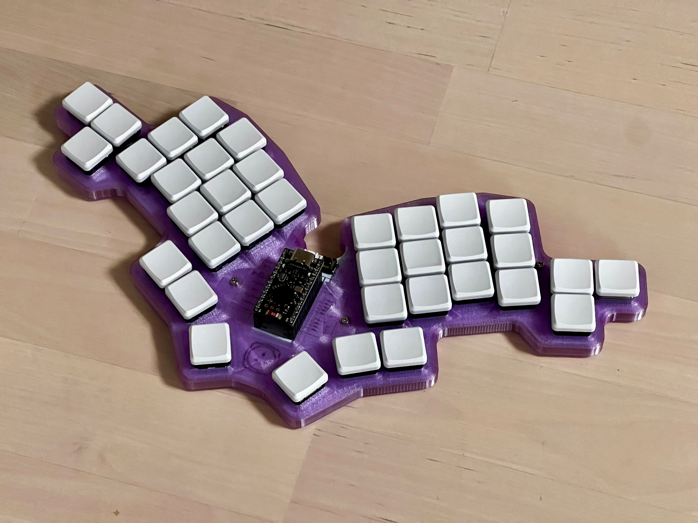

- 3 keys thumb cluster with an *outer* key instead of an extra *inner* key
  - Feels very natural
  - v2: move the cluster ~1mm back towards the hand
- Pinky side extension key
  - Moving the pinky to the side is surprisingly comfortable, hence the side extension
  - v2: add back the top row pinky key for gaming!
- Stagger and splay
  - Slightly more agressive than the Tern, optimized for my own hands
- Unibody
  - Simpler for a first full self-designed keyboard!
  - Tolkeeb Alpha will be split
- Low profile switches
  - Choc v1 hotswap sockets, I'll be able to reuse my switches on future projects!
- Wireless
  - The controller is a nice!nano v2 clone, making it easily wireless

Making a keyboard from scratch was a great experience thanks to [FlatFootFox's Ergogen's guide](https://flatfootfox.com/ergogen-introduction/). I had to learn basics of KiCAD and this taught me fully how keyboards work.

It was also surprisingly cheap, at only 15$ for printing 5 copies of my PCB, ~30$ for the switches, ~10$ for the controller, and ~10$ for misc components. If I didn't buy a 3d printer to learn how to design cases, it would have been around 70$ total!

# Conclusion

Physical keyboard layouts have gone through many evolutions in the last decade as many enthusiasts have designed their own keyboards.

I think almost all the points raised above are necessary for proper ergonomics, and many keyboards are now available that implement them.

Unfortunately, none of those keyboards are affordable nor easy to find. I hope that in the future, more companies will start producing ergonomic keyboards.

So while we wait for that, let's talk about software layouts in the next article!

<!-- TODO
2 - Firmware layouts
2.1 - Layers
2.2 - Home row modifiers
2.3 - Combos
2.4 - One-shot modifiers
3 - Tolkeeb Zero
 -->