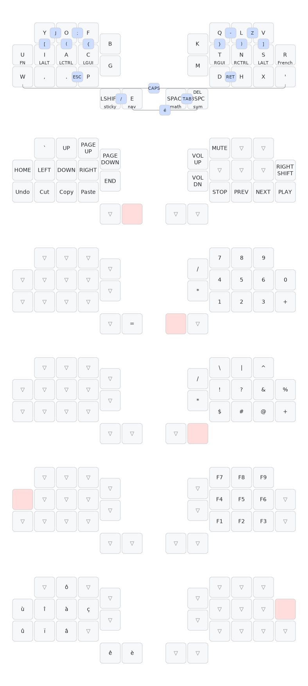

Part 1 taught us to **craft** an ergonomic keyboard so we could walk.

Part 2 will teach us to **optimize** an ergonomic layout so we can fly.

# Why

I often get asked why I tried so many alternative layouts and built my own.

My answer is why not.

I want typing on my keyboard to be an enjoyable, fast, and pain-free experience.

To maximize those things you need to delve into alternate layouts.

And if you're typing in multiple languages, you might be breaking new ground.

# Optimizing alpha

Alpha = alphanumeric characters, ie letters.

## Alternating

If you got interested in alternative layouts you might know
[Dvorak](https://en.wikipedia.org/wiki/Dvorak_keyboard_layout) or
[BÉPO](https://en.wikipedia.org/wiki/B%C3%89PO).

```diff
+ Dvorak
  ' , . p y f g c r l /
  a o e u i d h t n s -
  ; q j k x b m w v z  

- Bépo
  b é p o è ^ v d l j z w
  a u i e , c t s r n m ç
ê à y x : k ' q g h f
```

Those two layouts optimize two metrics:

- ↑ hand alternation
  - This results in grouping vowels on one hand
- ↓ finger travel
  - This puts oft-used keys on the home row

This is a very good start and already results in much better typing comfort. I
used Bépo for 10 years and Dvorak for 3 before moving on to more exotic
solutions.

But they have some issues.

Bépo:

- French-focused when my English typing is at least half, if not more, of my
typing time
- Heavy usage of AltGr, sometimes creating issues with system shortcuts
- Changing symbols position when moving to 1.1 😡
- Complex installation, especially if used with other languages like Japanese

Dvorak:

- Too english focused, making it much harder to type French efficiently
- No accents of course
- L is on a pinky extension. This is egregious.

I liked Dvorak for a short while as it is installed on all machines (yes, even
Windows or iOS), but it became quickly apparent this was simply not a good
keyboard disposition. It is ancient.

It was time to change the problem by introducing new metrics.

## Same finger digrams

Hitting two different keys with the same finger in a row is called a Same-Finger
Bigram (SFB):

| Layout  | SFB   |     |
| ------- | ----- | --- |
| QWERTY  | 6.67% | 🤮 |
| Dvorak  | 2.74% | 👍 |
| Bépo    | 2.57% | 👍 |
| Colemak | 1.32% | 🍾 |

[Colemak](https://en.wikipedia.org/wiki/Colemak) emerged in 2006 to improve upon
Dvorak by reducing SFBs by 50%.

```diff
+ Colemak
  q w f p g  j l u y ;  
  a r s t d  h n e i o '
  z x c v b  k m , . /  
```

Colemak was a great start, and it was improved as well with **Colemak-DH**,
which is the layout I'd recommend for normal people! It minimally iterates upon
QWERTY while providing great ergonomics.

```diff
+ Colemak-DH
  q w f p b  j l u y ;
  a r s t g  m n e i o
  z x c d v  k h , . /
```

Honestly, give it a try if you never looket at alternative layouts. If you type
on a QWERTY derivative, this is a great starting point.

But I'm not normal and I want to go deeper.

## Rolls

Here's what I did not show in the previous table:

| Layout  | SFB   | Alternates |
| ------- | ----- | ---------- |
| QWERTY  | 6.67% | 19.5%      |
| Dvorak  | 2.74% | 35.7%      |
| Bépo    | 2.57% | 33.0%      |
| Colemak | 1.32% | 22.7%  😱 |

Colemak cut SFBs in half at the cost of bringing alternates down almost to
QWERTY level.

Was it worth it?

It actually made Colemak *better*.

You see the issue was not actually about alternating hands. It was about smooth
and fluid movement.

And one of the smoothest movement is the **roll**: when you type multiple keys
on the same hand in a row, going in a single direction, with different fingers.

**Inrolls** in particular feel very natural, when you roll towards the center of
*the keyboard.

And Colemak is a rolling layout:

| Layout  | SFB  | Alternates | Rolls |
| ------- | ---- | ---------- | ----- |
| QWERTY  | 6.7% | 19%        | 37%   |
| Dvorak  | 2.8% | 36%        | 38%   |
| Bépo    | 2.6% | 33%        | 41%   |
| Colemak | 1.3% | 23%        | 46%   |

By introducing and optimizing SFBs and rolls, Colemak ushered in the era of
modern keyboard layouts.

## Single finger skipgram, scissors, and going way too deep

Step by step, people started adding more metrics to the optimization process.

Here are some of the most popular metrics as of 2024:

- Same Finger Skipgrams (SFS)
  - When you use the same finger for two different letters separated by one
  letter
  - Also called Disjointed Same Finger Bigrams (DSFB)
  - Reduces typing speed by requiring quick finger movement
- Scissors
  - Same-hand bigrams made of a key in the upper row and one in the lower row,
  where the shorter finger is below the longer finger
  - It feels really weird and unergonomic
  - X -> T on a QWERTY keyboard
- Redirects
  - One handed trigrams where the typing direction changes
  - SAD on a QWERTY keyboard, as SA is outward and AD is inward

One you add those new metrics to optimization you end up with "post-modern" layouts like [Gallium](https://github.com/GalileoBlues/Gallium):

```diff
+ Gallium 
  b l d c v  j y o u ,
  n r t s g  p h a e i
  x q m w z  k f ' ; .
```

| Layout     | SFB  | Alternates | Rolls | SFS | Scissors | Redirects |
| ---------- | ---- | ---------- | ----- | --- | -------- | --------- |
| QWERTY     | 6.7% | 19%        | 37%   | 11% | 2%       | 13%       |
| Dvorak     | 2.8% | 36%        | 38%   | 7%  | 0.17%    | 1.4%      |
| Bépo       | 2.6% | 33%        | 41%   | 8%  | 0.6%     | 1.9%      |
| Colemak-dh | 1.3% | 23%        | 46%   | 9%  | 0.24%    | 5.3%      |
| Gallium    | 0.9% | 34%        | 44%   | 6%  | 0.4%     | 1.8%      |

Most of those very modern layouts use the `nrts` and `heia` home rows, and the
variation comes down to columns and personal preference.

There are many niche metrics that can be optimized and they're very well
explained in the [2nd edition of the keyboard layout
doc](https://docs.google.com/document/d/1Ic-h8UxGe5-Q0bPuYNgE3NoWiI8ekeadvSQ5YysrwII/edit)
if you're willing to read a 176 pages treaty on the subject!

## Thumb alpha

But for some people even those 176 pages aren't enough.

Our strongest finger is the thumb. And ergonomic keyboards at least have two
independant thumb keys, and usually 4 to 6.

Putting letters on keys *completely* changes the layout. You go from 8 columns
to 10.

This is Thumb Alpha.

There are two big schools of thumb alpha:

- Putting `e` on a thumb key as it's the most common letter in English (and French)
  - Changes layouts the most since you get rid of depenencies to `e`
  - [`aptmak` was one of the first thumb-alpha layouts](https://github.com/Apsu/aptmak)

```diff
+ Aptmak
v w f p b  j l u y '
r s t h k  x n a i o
  c g d      m , .
           e
```

- Putting "problem keys" on thumb keys, *ie* keys hard to put in standard columns (like `r`)
  - Still a very new approach
  - [Dusk](https://altlayouts.com/dusk/index.html) is a great example created in April 2024

```diff
+ Dusk
x f d p q  j ' o u .
n s t c y  m h a e i
b v k g w  z l _ / ,
        r   
```

And here is the final tally:

| Layout     | SFB  | Alternates | Rolls | SFS | Scissors | Redirects |
| ---------- | ---- | ---------- | ----- | --- | -------- | --------- |
| QWERTY     | 6.7% | 19%        | 37%   | 11% | 2%       | 13%       |
| Dvorak     | 2.8% | 36%        | 38%   | 7%  | 0.17%    | 1.4%      |
| Bépo       | 2.6% | 33%        | 41%   | 8%  | 0.6%     | 1.9%      |
| Colemak-dh | 1.3% | 23%        | 46%   | 9%  | 0.24%    | 5.3%      |
| Gallium    | 0.9% | 34%        | 44%   | 6%  | 0.4%     | 1.8%      |
| Aptmak     | 1.1% | 24%        | 47%   | 6%  | 0.7%     | 5.7%      |
| Dusk       | 0.5% | 21%        | 39%   | 5%  | 0.7%     | 2.6%      |

## Tooling

### Oxeylyzer

To compute all the metrics in the tables above I used
[Oxeylyzer](https://github.com/O-X-E-Y/oxeylyzer).

The tool is **very** unergonomic but it's the best we have right now!

You can feed it a layout and a corpus and it will give you all the metrics,
and you can fix a few keys then ask it to try and optimize it.

### Corpus selection

One thing I failed to mention so far is the corpus selection.

So far I used a standard English corpus for Qwerty, Dvorak, and Colemak, and a
standard French corpus for Bépo.

But I type in both English and French!

So for my own calculations I use a corpus that's made up of 50% English and 50%
French.

The biggest differences are:

- é being the 13th most common letter in French and not existing in English
- bigrams being widely different because of English's nonsensical spelling
  - `th` is the most common English bigram and ~200th in French
  - Don't get me started on `ng` and `sh`

As I was the first one actually iterating on layouts with this corpus I ended
up with a very unique layout... Perfectly tailored to my needs!

Diving into my own layout will warrant its own post, so let's keep it for later.

# Non-alpha

Besides alphabetic symbols, keyboards are used to type numbers and symbols.

But those are much rarer than letters.

So how do you put those keys in an ergonomic and easy to remember spot?

## Layers

Layers are core to most custom layouts.

A layer is a layout for your keyboard, and custom firmwares allow you to switch
between them.

One of the most common layers is the numbers layer, arranged like a numpad:

```js
7 8 9
4 5 6
1 2 3
  0 .
```

And symbol layers are also very common. Here's mine, used on the right hand:

```diff
/ \ | ^    # bars
* ! ? & %  # punctuation
  $ # @ +  # other
```

As you can see, it makes both symbols and numbers very easy to reach. No upper
upper row, no double pinky extensions.

But how do you activate and use those layers?

### Hold-Tap

In a very compact and ergonomic keyboard, dedicating a full key to switch layers
is a impossible. It would also require you to switch back to the base layer every time,
resulting in 3 inputs to type a single number or symbol.

The solution to that is [hold-tap](https://zmk.dev/docs/behaviors/hold-tap), a feature of all modern keyboard firmwares.

When you type a key it acts as normal and sends its keycode to the system.

But while you hold it and type another key, it uses the layer's version of that
key. It can be [customized to make sure it never triggers when typing
fast](https://zmk.dev/docs/behaviors/hold-tap#advanced-configuration).

While we're at it we can do the same for modifiers: ⌘, ⌥, ⌃, and ⇧. This is
called home-row modifiers, [and it deserves its own 10k words
essay.](https://precondition.github.io/home-row-mods)

Combine it all, and you get the Colemak-DH based [Miriyoku layout](https://github.com/manna-harbour/miryoku):


Miriyoku is the most famous ultra compact ergo layout. It's a great starting
point for english typists, but I have one big issue with it.

### Shift and Stickies

I simply don't like having shift on home row modifiers. Shift is one of the most
used keys on a keyboard, on par with backspace.

And there's one big plus to having a dedicated shift key: [sticky keys](https://zmk.dev/docs/behaviors/sticky-key).

You press shift, release it, and your next key will be capitalized.

You can still hold it as normal, but you won't want to. Once you're used to
sticky keys, you'll never want to go back.

No overlapping inputs, no slowing down to make sure you didn't accidentally
capitalize two letters in a row, ...

Give sticky shift a try in your next layout!

## Combos

One other thing that's not in Miryoku and that I love is [combos](https://zmk.dev/docs/features/combos).

Combos trigger when you press two keys simultaneously.

They're surprisingly easy, especially on "rare" key combinations that are easy to remember:

- Opposites (double pinky lower row, double thumbs, ...)
- Vertical combos (same finger)
- Adjacent keys with rare bigrams (`.p` or `dh` for me)

In particular, I love having `[({` and `})]` on oppposite vertical combos. It's
very easy to remember, you never fire them by mistake, and it reduces the need
for layers.

Good combos feel just like a standard key to type. You don't really lose any typing
speed.

Combos are still a relatively new feature so it's not as widespread as layers in
custom layouts.

We're really at the state of the art, aren't we?

# QLV

To close it out, here's was the 30 keys version of my current layout:



While it might look a bit overwhelming it was very easy for me to memorize the
layers and combos because they made sense. I placed each key and each layer with
a purpose, making it easy to remember.

Learning the QLV alpha layer is of course what took me the most time. I've been
typing on it for about 9 months now and I'm back to above 100 WPM.

But QLV1 wasn't perfect, and 30 keys ended up being a bit too few in my opinion.

So QLV2 is coming very soon and will get its own post!
