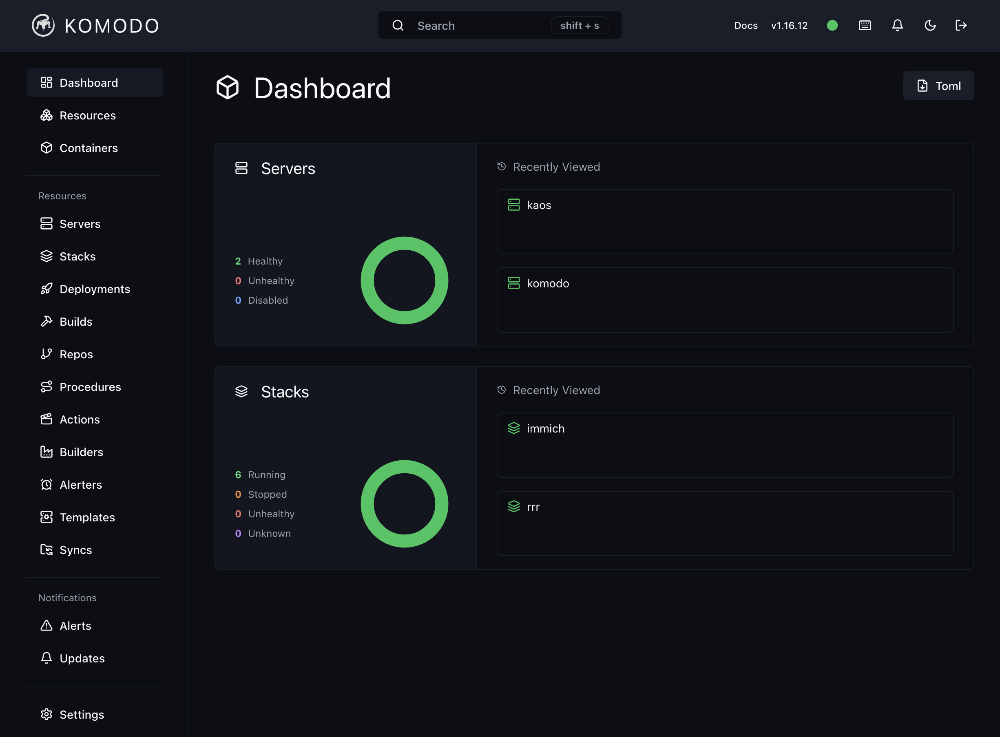
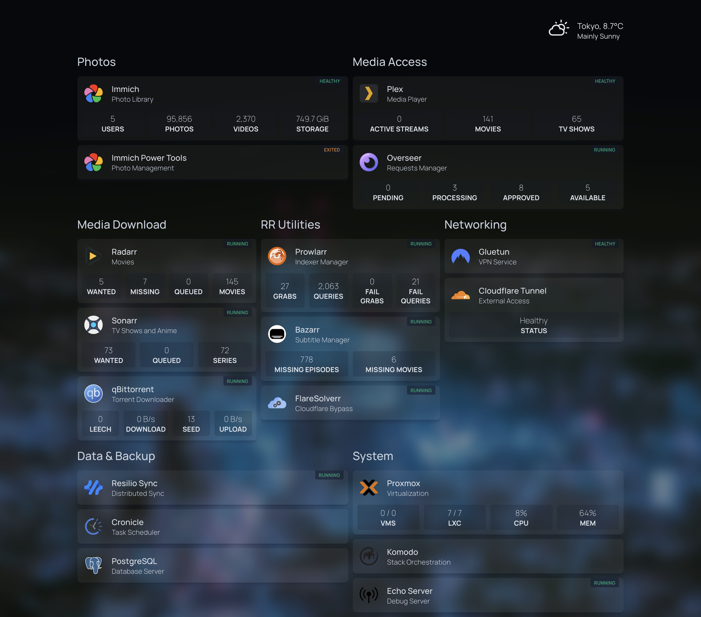

I have a PC that's always on. It hosts my media, my photos, my videos, my RAW files, my backups, and a few other things.

Some call it a homelab, some call it a server, some call it a NAS. In the end, it's just another PC.

Let's quickly review the hardware, the software, and the services I run on it.

# Hardware

## Processing

Until now, I had two machines. One was dedicated to storage and had a very old Intel dual core CPU,
the other was dual Xenon 2U server I bought from Yahoo auction for cheap.

When my son was born, I got rid of the 2U server because of the noise and size.

I tried moving all my apps to the storage servers but many died in the process of scaling down.

Then a few months ago, [TrueNAS Scale decided to kill its services stack](https://www.reddit.com/r/truenas/comments/1djk3tb/no_updates_for_truenas_scale_apps_until_q4/) *again*, and I had to re-install everything anyways.

I therefore shunked my old workstation to get a shiny **Ryzen 5800X** out and bought a new motherboard with enough SATA ports for my 6 drives.

Then I discovered that some B550 motherboards don't let you use both NVMe drives *and* all 6 SATA ports. It's usually in the fine prints.

So I spent hours finding another motherboard. I settled on another B550 motherboard as it sucks up 5W compared to the ~15W of the X570.

It had the same issue. Written [*absolutely nowhere in the product page*](https://www.asus.com/uk/motherboards-components/motherboards/tuf-gaming/tuf-gaming-b550-plus/), with not as much as a single asterisk, my second rebuild was a failure.

I got an X570 motherboard. It booted and saw my disks. I was awash with joy.

## Networking

While I was at it, I decided to scale up to 10G networking locally. PCIe 10G SFP+ cards are extremely cheap (<$20) and switches are not that expensive either.

But getting 10G on my Macbook Pro was a pain so I settled on a mixed 2.5G/10G networking setup.

And yes I max out my local network all the time as I take way too many photos of my beautiful son and backup the RAW files.

It only took me 30 hours to select a switch + AP combo and deciding against getting a new router. I listened to my network engineers friends and got a Mikrotik managed switch with a Ubiquiti AP:

- [MikroTik CRS310-8G+2S+IN](https://www.getic.com/product/mikrotik-crs310-8g-2s-in)
- [Ubiquiti UniFi U7 Pro](https://www.getic.com/product/access-point-u7-pro)
- [TP Link 2.5 PoE+ Injector](https://www.tp-link.com/jp/business-networking/accessory/tl-poe260s/)

It worked... Except the switch was loud. Very loud. On my desk. In the living room.

I modded it with a Noctua fan. Better.

Then I realized I could have bought a cheap unmanaged switch that also had 10G SFP+ ports and 2.5G ethernet ports, but with integrated PoE and fanless... [For a quarter of the price](https://www.amazon.co.jp/dp/B0D1C5KCGJ?ref=ppx_yo2ov_dt_b_fed_asin_title). Apparently, network engineers don't look at the prices of their equipment.

Networking is funny. When a specific form factor + size gets popular and chinese manufacturers start making it, prices drop like a rock.

So I sold my Mikrotik switch on Mercari. For a profit, because they're very hard to find in Japan. Maybe I should become a reseller?

I was ready to boot.

# OS, storage, and orchestration

## OS

When I had two machines, I used [Proxmox](https://www.proxmox.com/en/products/proxmox-virtual-environment/overview). It worked great.

Scaling down to one machine, I tried TrueNAS Scale. It was a disaster for anything that wasn't storage.

So I'm back on Proxmox. The [Proxmox VE Helper-Scripts](https://community-scripts.github.io/ProxmoxVE/) repo is a big part of it.

Run [PVE Post Install](https://community-scripts.github.io/ProxmoxVE/scripts?id=post-pve-install), [create a Docker LXC](https://community-scripts.github.io/ProxmoxVE/scripts?id=docker), and you're good to go.

## Storage

I use [ZFS](https://en.wikipedia.org/wiki/ZFS). I had to choose between:

- Managing ZFS directly in PVE and bind mounting the datasets to the containers
  - SMB shares and [`rclone`](https://rclone.org/) get their own LXC and manual config

- Using disks passthrough to a TrueNAS Scale VM
  - Great SMB and disk management interface
  - `rclone` integration

I really disliked my experience with TrueNAS Scale so I went with the first option.

Been working fine so far. SMB was a bit of a pain to setup but it's working.

## Orchestration

To manage my apps, over the years I tried:

- Direct docker commands
- One big docker compose file
- Multiple stacks
- Single node kubernetes
- Actual kubernetes

I knew [Docker Swarm](https://docs.docker.com/engine/swarm/) was pretty good now and I wanted to give it a shot, but then I heard of [komodo](https://komo.do/).

It looked like the right level of abstraction and automation for me, so I gave it a shot.

After a little bit of tweaking I got it to be work and be fully automated. I now have a `kaos-stack` private repo with my apps and any push to the `main` branch triggers a redeploy.

Plus, cool interface:

# Services

Finally, the meat of the server. I run a few services:

- [Cloudflare Zero Trust Tunnels](https://developers.cloudflare.com/cloudflare-one/connections/connect-networks/) to give outside access to my apps
  - Setup was painless, it works great with having my DNS there, and it was an order of magnitude simpler than setting up an Nginx reverse proxy with open ports
- The [`rrr` stack](https://wiki.servarr.com/) to download and manage content I can access legally otherwise
  - Yes I still have a Netflix subscription, I just like to have a local copy like in the good old days
- [Immich](https://immich.app/) as a Google Photos replacement
  - I could make a full blog post of my hate for Google Photos but it is now in the adversarial design stage: it makes regular choices that makes it *worse* for its users
  - And Immich is great for videos, where I software trancode them to HEVC in the medium profile to take only a few MBs while keeping great visual clarity
- [Cronicle](https://cronicle.net/) to manage my cron jobs (rclone backups, zfs snapshots, etc)
- [Resilio Sync](https://www.resilio.com/sync/) to have access to all my files anywhere
  - Not perfect, but still better than Nextcloud Files
  - I'm looking for a better alternative that supports selective sync, is fast, and has a good mobile app. Maybe [SpaceDrive](https://www.spacedrive.com/) one day?

As I'm moving soon, I have not setup Home Assistant again. But it's next.
